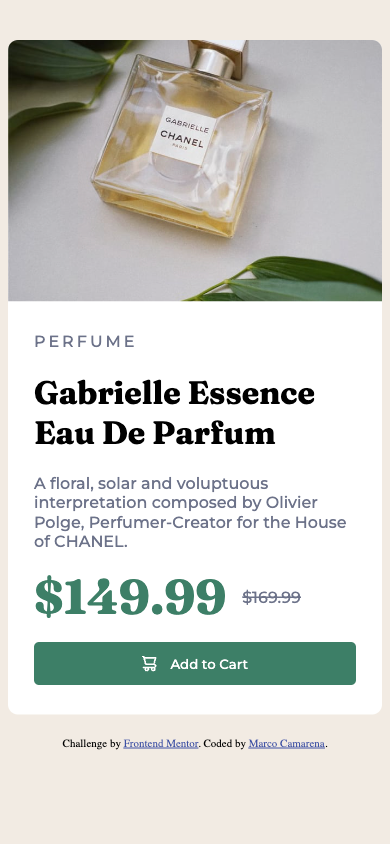

# Frontend Mentor - Product preview card component solution

This is a solution to the [Product preview card component challenge on Frontend Mentor](https://www.frontendmentor.io/challenges/product-preview-card-component-GO7UmttRfa). Frontend Mentor challenges help you improve your coding skills by building realistic projects.

## Table of contents

-   [Overview](#overview)
    -   [The challenge](#the-challenge)
    -   [Screenshot](#screenshot)
    -   [Links](#links)
-   [My process](#my-process)
    -   [Built with](#built-with)
    -   [What I learned](#what-i-learned)
    -   [Continued development](#continued-development)
    -   [Useful resources](#useful-resources)
-   [Author](#author)
-   [Acknowledgments](#acknowledgments)

## Overview

### The challenge

Users should be able to:

-   View the optimal layout depending on their device's screen size
-   See hover and focus states for interactive elements

### Screenshot



### Links

-   Solution URL: [Add solution URL here](https://your-solution-url.com)
-   Live Site URL: [Add live site URL here](https://your-live-site-url.com)

## My process

### Built with

-   Semantic HTML5 markup
-   CSS custom properties
-   Flexbox
-   Mobile-first workflow

### What I learned

Use this section to recap over some of your major learnings while working through this project. Writing these out and providing code samples of areas you want to highlight is a great way to reinforce your own knowledge.

To see how you can add code snippets, see below:

Importing fonts directly on CSS

```css
import url('link');
```

Setting variables in CSS

```ccs
::root {
    --var1: parameters;
    --var2: parameters;
}
```

### Continued development

I would like to develop more using Flex and Grid.

### Useful resources

-   [CSS Variables](https://www.w3schools.com/css/css3_variables.asp) - This help me set the colors variables in the CSS stylesheet.
-   [Custom fonts](https://www.pagecloud.com/blog/how-to-add-custom-fonts-to-any-website) - Learned how to add custom fonts in my CSS.

## Author

-   Website - [Marco Camarena](https://www.marcocamarena.dev)
-   Frontend Mentor - [@maco-data](https://www.frontendmentor.io/profile/maco-data)
-   Twitter - [@uleg3nd](https://www.twitter.com//uleg3nd)

## Acknowledgments

I would like to thanks [Keving Powell](https://www.youtube.com/@KevinPowell) for all the tips and trick and for guiding me to Frontend Mentor.
